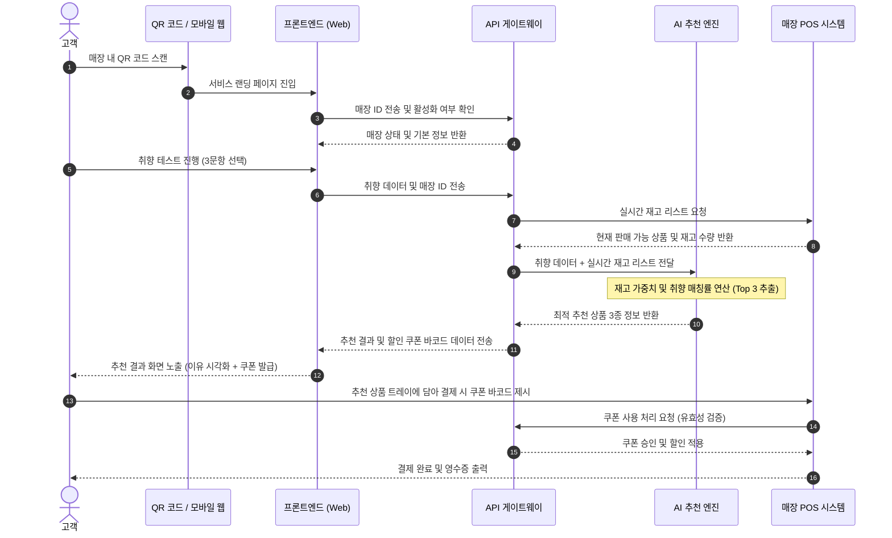

# [24.10.24] AI 기반 개인 맞춤형 베이커리 큐레이션 서비스 '빵비게이터(Bread-vigator)' 상세 요건 명세서 (PRD)

---

## 0. 문서 개요

### 0.1 프로젝트 요약
본 프로젝트는 오프라인 베이커리 매장을 방문하는 고객의 선택 장애를 해결하고, 개인의 취향, 건강 상태(알레르기/식단), 그리고 매장의 실시간 재고 상황을 종합적으로 반영하여 최적의 상품을 추천하는 AI 기반 큐레이션 서비스 **'빵비게이터(Bread-vigator)'**의 개발을 목표로 합니다. 

### 0.2 추진 배경
* **소비자 측면 (Choice Overload):** 베이커리 매장 내 상품 수는 평균 50~80종에 달하나, 텍스트 위주의 단순한 안내판만으로는 맛, 식감, 성분 정보를 직관적으로 파악하기 어려워 구매 결정에 병목이 발생합니다.
* **매장 측면 (Inefficiency):** 고객의 매장 체류 시간은 길어지나(평균 12분 30초) 실제 구매로 이어지는 전환율은 낮고, 인지도가 낮은 비선호 메뉴 및 신메뉴의 폐기율(평균 18.5%)이 높아 수익성이 저하됩니다.
* **해결 방향:** 온/오프라인을 연결하는 가벼운 Web-based MVP(Phase 1)를 시작으로, POS 및 회원 시스템 연동(Phase 2), 나아가 B2B SaaS 및 수요 예측 모델(Phase 3)로 확장하여 오프라인 F&B 매장의 정보 비대칭성을 혁신하고자 합니다.

---

## 1. 목표 (Goal)

### 1.1 프로젝트 목표
고객에게는 탐색 비용을 최소화하는 초개인화된 구매 경험을 제공하고, 점주에게는 실시간 재고 소진 및 객단가 상승을 통한 매출 극대화 도구를 제공하여 오프라인 베이커리 비즈니스의 선순환 구조를 확립합니다.

### 1.2 성공 기준 (Success Metrics)

| 구분 | 지표 항목 | 현재 수준 (As-Is) | 목표 수준 (To-Be) | 측정 방법 및 데이터 소스 |
| :--- | :--- | :--- | :--- | :--- |
| **비즈니스** | **구매 전환율 (CVR)** | 72% | **88% (+16%p)** | 매장 방문객 수(센서/카운터) 대비 POS 결제 건수 비율 |
| **비즈니스** | **평균 객단가 (AOV)** | 12,500원 | **15,000원 (+20%)** | POS 결제 데이터 기준 일별/월별 평균 결제 금액 |
| **사용성** | **의사결정 시간** | 12분 30초 | **7분 (-41%)** | QR 코드 최초 스캔 시점부터 POS 최종 결제 완료 시점까지의 타임스탬프 차이 |
| **운영 효율** | **비선호/신메뉴 폐기율** | 18.5% | **8.0% (-10.5%p)** | 일일 마감 시 폐기 등록된 비선호/신메뉴 수량 / 당일 총 생산량 |

---

## 2. KPI 및 측정지표

### 2.1 핵심 KPI (Key Performance Indicators)
1. **추천 구매 전환율 (Recommendation CVR):** AI 추천을 받은 고객 중 추천 상품을 실제로 구매한 고객의 비율 (목표: 45% 이상)
2. **재고 소진 기여도:** 실시간 재고 가중치 추천을 통해 판매된 마감/비선호 상품의 일별 판매량 증가율 (목표: 전월 대비 30% 상승)
3. **고객 만족도 (CSAT):** 추천 완료 화면 및 알림톡을 통해 수집된 추천 결과 만족도 점수 (목표: 4.5 / 5.0)

### 2.2 보조 지표 (Supporting Metrics)
* **QR 스캔율:** 매장 방문객 대비 QR 코드 접속자 수 비율
* **큐레이션 완수율 (Completion Rate):** 취향 테스트 진입 후 이탈 없이 최종 추천 결과 페이지까지 도달한 비율
* **쿠폰 회수율 (Redemption Rate):** 추천 결과로 발급된 할인 쿠폰이 POS에서 실제 사용된 비율

### 2.3 시스템 모니터링 지표 (System Health Metrics)
* **AI 추천 API 응답 속도 (Latency):** 95th Percentile 기준 1.5초 이하
* **POS 재고 동기화 지연 시간 (Sync Delay):** POS 재고 변동 발생 후 AI 엔진 반영까지의 시간 (목표: 1분 이내)
* **API 에러율 (Error Rate):** HTTP 5xx 에러 발생 비율 (목표: 0.1% 미만)

---

## 3. 사용자 및 이해관계자

### 3.1 대상 사용자 (Target Audience)

```
[결정 장애형 고객] ───> 매장 체류 시간 단축, 직관적인 맛/식감 정보 제공 필요
[식단 관리형 고객] ───> 알레르기 유발 물질 필터링, 영양 성분(저당, 글루텐프리) 정보 제공 필요
[트렌드 민감형 고객] ──> SNS 인기 메뉴, 신메뉴 추천 및 실패 없는 선택 지원 필요
```

* **제외 대상 (Out of Scope):** 
  * 단체 주문 및 B2B 납품 목적의 대량 구매 고객 (개인화 추천의 실효성이 낮음).
  * 생명에 치명적인 수준의 초고위험 알레르기 보유자 (의학적 전문 진단 영역이므로 서비스 책임 한계 설정 및 경고 문구 노출 필수).

### 3.2 이해관계자 정의

| 이해관계자 | 역할 및 책임 | 주요 요구사항 | 시스템 접점 |
| :--- | :--- | :--- | :--- |
| **매장 점주 (Owner)** | 매장 운영 및 재고 관리, 프로모션 설정 | 폐기율 감소, 마감 세일 자동화, 매출 통계 확인 | 점주용 웹 어드민 (Admin Dashboard) |
| **매장 직원 (Staff)** | 실시간 재고 입력 및 POS 결제 처리 | 추천 쿠폰의 간편한 바코드 스캔 처리, 재고 오차 최소화 | 매장 POS 시스템 |
| **HQ 마케터 (HQ)** | 브랜드 프로모션 기획 및 쿠폰 발행 | 신메뉴 홍보 가중치 설정, 고객 취향 데이터 분석 | 통합 관리자 어드민 |
| **개발/인프라 팀** | 시스템 안정성 확보 및 API 연동 | POS-AI 엔진 간 실시간 동기화, 트래픽 스파이크 대응 | API Gateway, DB, AI Engine |

---

## 4. 정책 정의

### 4.1 기본 정책
1. **실시간 재고 연동 우선 정책:** AI 추천 엔진은 현재 매장 재고가 1개 이상 남아있는 상품만을 추천 후보군으로 삼는다. (재고 0인 상품 추천 금지)
2. **개인정보 보호 정책:** MVP 단계에서는 비회원 기반으로 운영하며, 브라우저 쿠키 및 세션 ID를 활용해 일회성 취향 데이터를 처리한다. 개인정보 수집을 최소화한다.
3. **쿠폰 사용 정책:** 추천 결과 페이지에서 발급된 쿠폰은 당일 해당 매장에서만 사용 가능하며, 타 할인 혜택과 중복 적용이 불가하다.

### 4.2 상태값 정의 테이블

| 도메인 | 상태값 (Status) | 정의 | 전이 조건 (Transition Trigger) |
| :--- | :--- | :--- | :--- |
| **추천 세션** | `INIT` | QR 스캔 후 최초 진입 상태 | 페이지 로드 완료 시 |
| | `SURVEYING` | 취향 테스트 진행 중 | 1번 문항 답변 선택 시 |
| | `COMPLETED` | 추천 결과 노출 완료 | 마지막 문항 답변 완료 및 AI 연산 성공 시 |
| | `EXPIRED` | 세션 만료 (30분 간 미활동) | 세션 타임아웃 발생 시 |
| **쿠폰** | `ISSUED` | 쿠폰 발급 완료 (바코드 생성) | 추천 결과 화면에서 '쿠폰 받기' 클릭 시 |
| | `USED` | POS에서 쿠폰 사용 완료 | POS 바코드 스캔 및 결제 승인 시 |
| | `EXPIRED` | 쿠폰 유효기간 만료 (당일 마감) | 매장 영업 종료 시간 도래 시 |
| **재고** | `IN_STOCK` | 재고 여유 (3개 이상) | POS 판매 데이터 수신 시 |
| | `LOW_STOCK` | 품절 임박 (1~2개) | 재고 수량이 설정된 임계값 이하로 떨어질 시 |
| | `OUT_OF_STOCK`| 품절 (0개) | 재고 수량이 0이 될 시 (추천 대상 즉시 제외) |

### 4.3 예외 정책 테이블

| 예외 상황 | 영향도 | 판단 기준 | 대응 정책 (Fallback Policy) |
| :--- | :--- | :--- | :--- |
| **POS API 타임아웃** | 상 | POS 재고 조회 API 응답이 1.0초 이상 지연될 시 | 최근 10분 내 캐싱된 재고 데이터를 기준으로 추천을 진행하고, 화면 하단에 "실시간 재고와 일부 차이가 있을 수 있습니다" 문구 노출 |
| **AI 추천 엔진 장애** | 상 | AI 추천 API가 5xx 에러를 반환하거나 응답이 1.5초 이상 지연될 시 | 룰베이스 기반의 '매장 실시간 베스트셀러 Top 3' 상품을 즉시 대체 노출하여 사용자 경험 단절 방지 |
| **추천 직후 품절 발생** | 중 | 추천 화면 노출 후 결제 직전 타 고객이 해당 상품을 구매하여 품절될 시 | POS 결제 시점에 "죄송합니다. 추천 상품 중 [상품명]이 방금 품절되었습니다. 대체 상품 [대체상품명]으로 혜택을 적용하시겠습니까?" 팝업 노출 및 쿠폰 전환 적용 |
| **영업시간 외 접속** | 하 | 매장 영업시간 외에 QR 코드를 스캔할 시 | "현재는 영업시간이 아닙니다. 내일 맛있는 빵으로 찾아뵙겠습니다!" 안내 페이지로 리다이렉트 |

---

## 5. 서비스 구조 (유저 플로우)



---

## 6. 상세 요구사항

### 6.1 기능 요구사항 (Functional Requirements)

| 요구사항 ID | 대분류 | 상세 요구사항 정의 | 우선순위 | 대상 Phase | 관련 정책 및 비고 |
| :--- | :--- | :--- | :--- | :--- | :--- |
| **REQ-01** | **진입 및 랜딩** | 사용자가 매장 내 QR 코드를 스캔하면 별도의 앱 설치 없이 모바일 웹 랜딩 페이지로 즉시 진입해야 한다. | P0 (Must) | Phase 1 | 매장 ID 파라미터 필수 포함 (예: `/curation?store_id=102`) |
| **REQ-02** | **취향 테스트** | 사용자는 맛(단맛/담백함 등), 식감(부드러움/바삭함 등), 건강 선호도(저당/비건/상관없음) 3가지 문항에 대해 객관식 답변을 선택할 수 있어야 한다. | P0 (Must) | Phase 1 | UI는 한 화면에 한 문항씩 노출 (Swipe 또는 Next 버튼) |
| **REQ-03** | **AI 추천 연산** | 입력된 취향 데이터와 실시간 POS 재고 데이터를 결합하여 매칭률이 가장 높은 Top 3 상품을 추천해야 한다. | P0 (Must) | Phase 1 | 추천 알고리즘은 가중치 부여 방식 적용 (재고 임박 상품에 가중치 +15%) |
| **REQ-04** | **추천 결과 시각화** | 추천된 3가지 빵에 대해 추천 사유 태그(예: `#당도20% #바삭함 #아메리카노와찰떡`)와 실시간 재고 상태를 직관적으로 노출해야 한다. | P0 (Must) | Phase 1 | 이미지, 상품명, 가격, 추천 사유 필수 포함 |
| **REQ-05** | **할인 쿠폰 발급** | 추천 완료 화면에서 즉시 사용 가능한 '1,000원 할인 쿠폰' 또는 '페어링 음료 할인 쿠폰' 바코드를 발급해야 한다. | P1 (Should) | Phase 1 | 1회용 바코드 이미지 생성 (POS 스캔용) |
| **REQ-06** | **알레르기 필터링** | 사용자가 설정한 알레르기 유발 물질(견과류, 우유, 밀가루 등)이 포함된 상품은 추천 후보군에서 원천 배제하는 필터 기능을 제공해야 한다. | P1 (Should) | Phase 2 | 회원 정보 또는 세션 내 사전 설정값 연동 |
| **REQ-07** | **실시간 POS 연동** | POS에서 상품이 결제될 때마다 실시간 재고 수량이 AI 추천 엔진의 가용 재고 DB에 1분 이내로 동기화되어야 한다. | P0 (Must) | Phase 2 | API Webhook 또는 주기적 폴링(Polling) 방식 채택 |
| **REQ-08** | **점주용 대시보드** | 점주가 웹 어드민을 통해 당일 추천을 통한 판매 현황, 폐기 감축량, 쿠폰 회수율을 실시간으로 모니터링할 수 있어야 한다. | P2 (Could) | Phase 2 | 일별/주별 리포트 다운로드 기능 포함 |

### 6.2 운영 요구사항 (Operational Requirements)
* **어드민 상품 메타데이터 관리:** HQ 관리자 및 점주는 신규 상품 등록 시 맛의 강도(1~5단계), 식감 유형, 알레르기 유발 성분 태그를 반드시 입력해야 추천 엔진에 반영됩니다.
* **쿠폰 캠페인 제어:** 마케터는 특정 기간, 특정 매장별로 발급할 쿠폰의 종류(정액/정률) 및 일일 발급 한도를 어드민에서 실시간으로 제어할 수 있어야 합니다.

### 6.3 데이터 요구사항 (Data Requirements)
* **로그 수집:** QR 스캔 시점, 문항별 선택 값, 추천 결과 리스트, 쿠폰 다운로드 여부, 최종 구매 상품 ID 및 결제 금액을 유저 세션 ID와 매핑하여 적재합니다.
* **데이터 보존 기간:** 개인정보가 포함되지 않은 행동 로그 및 추천 이력 데이터는 추천 모델 고도화를 위해 최소 2년간 보존합니다.

---

## 7. UX/UI 고려사항

### 7.1 로딩 화면 (Loading State)
* **상황:** 사용자가 취향 테스트를 마치고 추천 결과를 기다리는 동안 (최대 1.5초).
* **UI/UX 요건:** 
  * 단순 스피너 대신, 빵이 구워지거나 오븐에서 나오는 듯한 브랜드 아이덴티티를 담은 애니메이션 적용.
  * "고객님의 취향에 맞는 빵을 굽는 중입니다...", "오늘 매장에 남은 가장 신선한 빵을 찾는 중입니다..." 등의 마이크로카피를 순차적으로 노출하여 체감 대기 시간 단축.

### 7.2 실패 화면 (Error/Failure State)
* **상황:** 네트워크 단절, API 에러 등으로 추천 결과를 불러오지 못했을 때.
* **UI/UX 요건:**
  * "빵비게이터에 잠시 밀가루 먼지가 쌓였습니다."와 같은 위트 있는 에러 메시지 제공.
  * [다시 시도하기] 버튼을 화면 중앙에 크게 배치하여 사용자가 이탈하지 않고 재시도할 수 있도록 유도.

### 7.3 빈 화면 (Empty State)
* **상황:** 사용자의 알레르기 필터링 조건과 선호도를 모두 만족하는 상품의 매장 재고가 전량 품절되었을 때.
* **UI/UX 요건:**
  * "앗! 고객님만을 위한 특별한 빵이 방금 모두 판매되었습니다." 메시지 노출.
  * 대안으로 매장 내에서 가장 대중적이고 호불호가 갈리지 않는 '시그니처 베스트셀러' 상품 3종을 제안하며, "이 빵들은 어떠신가요?" 형태로 전환 유도.

---

## 8. 기술 고려사항

### 8.1 POS 연동 및 보안 (Security & Integration)
* **API Gateway 보안:** POS 시스템과 AI 추천 엔진 간의 통신은 HTTPS 프로토콜을 필수로 하며, API Key 인증 및 IP 화이트리스팅을 통해 비인가 접근을 원천 차단합니다.
* **입력값 검증 (Data Sanitization):** 어드민 및 사용자 입력 폼에 SQL Injection 및 XSS 방지 필터를 적용합니다. 특히 파일 업로드(빵 이미지 등) 시 파일명 필터링(특수문자 제거, UUID 변환) 및 확장자 제한(JPEG, PNG만 허용)을 엄격히 적용합니다.

### 8.2 API 타임아웃 및 격리 (Timeout & Isolation)
* **서드파티 API 격리:** 외부 POS API 또는 알림톡 발송 API 장애가 전체 추천 서비스의 다운타임으로 이어지지 않도록 서킷 브레이커(Circuit Breaker) 패턴을 도입합니다.
* **Pandoc 및 외부 라이브러리 보안 격리:** 어드민 내 리포트 PDF 변환 등을 위해 `pandoc`이나 외부 파싱 라이브러리를 사용할 경우, 시스템 권한을 최소화한 별도의 도커 컨테이너(Sandbox) 내에서 실행하여 원격 코드 실행(RCE) 리스크를 방지합니다.

---

## 9. 실험 및 검증

### 9.1 A/B 테스트 시나리오

```
[전체 매장 고객]
   │
   ├── 대조군 (Group A - 50%): 기존 매장 안내판 및 일반 QR (단순 메뉴판 노출)
   └── 실험군 (Group B - 50%): 빵비게이터 AI 개인화 추천 및 쿠폰 제공
```

* **가설:** "개인화된 AI 추천과 실시간 재고 기반의 혜택을 제공받은 실험군(Group B)은 대조군(Group A) 대비 구매 전환율이 15% 이상 높고, 의사결정 시간이 40% 이상 단축될 것이다."
* **실험 기간:** MVP 런칭 후 2주간 특정 직영점 3개소에서 동시 진행.

### 9.2 정성적 검증 (FGI)
* **대상:** 실험에 참여한 고객 중 쿠폰을 사용한 고객 20명, 미사용 이탈 고객 10명, 그리고 매장 점주 및 직원.
* **검증 내용:** 추천 결과의 신뢰도, UI 조작의 편의성, 매장 내 동선 혼잡도 개선 여부 파악.

---

## 10. 리스크 및 대응

| 리스크 요인 | 영향도 | 발생 가능성 | 대응 방안 (Mitigation Plan) |
| :--- | :--- | :--- | :--- |
| **실시간 재고 불일치** | 상 | 중 | POS 결제 데이터 동기화 주기를 1분 단위로 유지하되, 재고가 1개 남은 상품은 추천 알고리즘에서 자동으로 제외하는 '안전 마진 재고(Safety Stock = 1)' 정책을 적용하여 품절 상품 추천 리스크를 방지함. |
| **QR 코드 참여율 저조** | 중 | 상 | 매장 입구, 트레이 매트, 집게 거치대 등 고객의 시선이 머무는 동선마다 QR을 배치하고, "첫 참여 시 100% 당첨 아메리카노 쿠폰" 등의 강력한 첫 구매 온보딩 프로모션을 병행함. |
| **알레르기 오추천으로 인한 법적 리스크** | 상 | 하 | 서비스 가입 및 필터 설정 화면에 "본 서비스의 성분 정보는 매장 제조 상황에 따라 교차 오염 가능성이 있으므로, 심각한 알레르기 보유자는 직원에게 재확인해 주시기 바랍니다"라는 법적 면책 고지(Disclaimer)를 명확히 노출함. |

---

## Appendix

### 용어 사전 (Glossary)
* **큐레이션 (Curation):** 다수의 상품 중 특정 기준(취향, 재고 등)에 따라 최적의 상품을 선별하여 제안하는 행위.
* **AOV (Average Order Value):** 평균 객단가. 고객이 1회 결제 시 지출하는 평균 금액.
* **CVR (Conversion Rate):** 구매 전환율. 매장 방문객 또는 서비스 접속자 대비 실제 결제 완료 고객의 비율.
* **Safety Stock (안전 재고):** 실시간 데이터 오차로 인한 품절 상품 추천을 막기 위해 설정하는 최소 재고 임계값.

### 문서 이력 (Revision History)

| 버전 | 개정일자 | 개정자 | 개정 내용 |
| :--- | :--- | :--- | :--- |
| v1.0 | 2024.10.24 | PRD Analyst 에이전트 | 최초 초안 작성 및 상세 요건 정의 완료 |